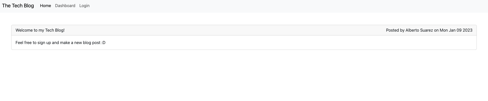
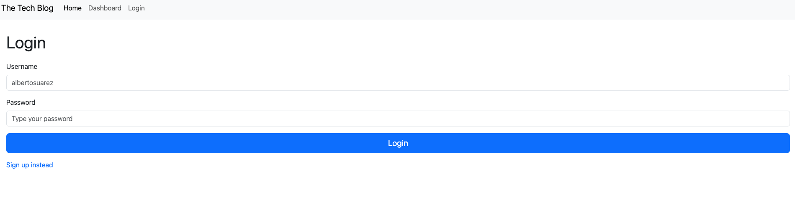
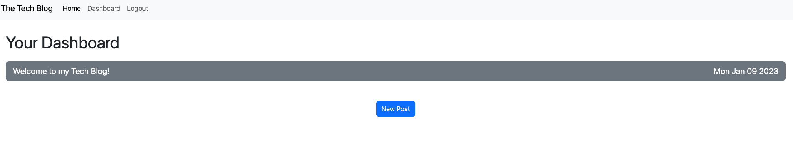
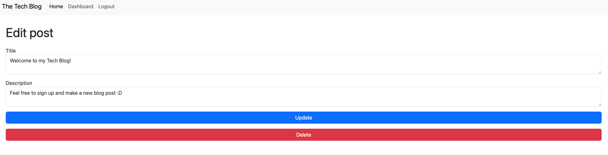

# The Tech Blog

## Description

This application was created in order to continue practicing my backend skills. In this application I also applied the MVC software architectural pattern in order to better arrange my overall code structure. In the future, I would like to add the ability for users to comment on other posts and add a theme to the overall website for nicer design purposes. 

## Deployed Website

The following is are screenshots and the url of the deployed website: 

- https://techy-blog.herokuapp.com/

## Usage

Non-users are able to enter the website and see all the posts made by other users. They are also given the option to sign up to the website and make their own blog posts. Each user has their own personalized dashboard where they are given the option to create new posts and update/delete their old posts. 

## Questions

If you have any further questions, please reach out to me using the following contact methods:
- Github: [albertosuarez8](https://github.com/albertosuarez8)
- Email: alberto.suarez8@outlook.com

## License 

This application is covered by ISC License